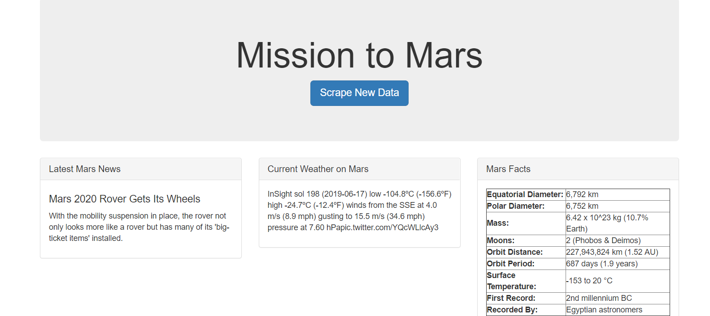
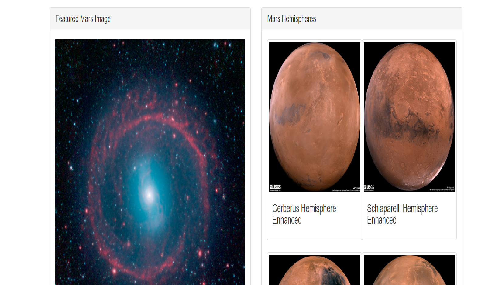

# Mission to Mars

This is a web application created from data scraped from various websites related to Mission to Mars. This exercise was completed using Jupyter Notebook, BeautifulSoup, Pandas and Requests/Splinter. 

Data used in this application is scraped from,

[NASA Mars News Site](https://mars.nasa.gov/news/)

[Nasa Recent Image Of Mars](https://www.jpl.nasa.gov/spaceimages/?search=&category=Mars)

[Recent Twitter Feed](https://twitter.com/marswxreport?lang=en)

[Mars Facts](https://space-facts.com/mars/)

[Mars Hemispheres](https://astrogeology.usgs.gov/search/results?q=hemisphere+enhanced&k1=target&v1=Mars)

Using MongoDB and Flask application to render the HTML page and splinter to navigate sites with BeautifulSoup parsing the data,

